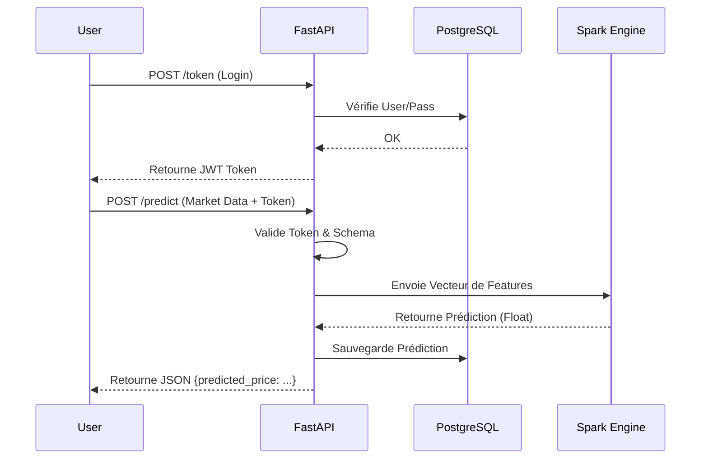

<div align="center">
<br />

<br /><br />

<div>


</div>

<h1>Quant AI API - Backend de Prédiction Financière</h1>

<p><strong>API REST Asynchrone + Inférence Spark ML + Architecture Microservices</strong></p>

</div>

## 1. Introduction

Ce projet constitue le cœur backend de la solution Quant AI. Il s'agit d'une API haute performance conçue pour fournir des prédictions de marché en temps réel en utilisant un modèle de Machine Learning distribué.

L'architecture repose sur une conteneurisation stricte via Docker, orchestrant une API FastAPI, une base de données PostgreSQL pour la persistance des résultats, et un moteur Apache Spark (Local) pour l'exécution des modèles prédictifs (Régression Linéaire).

### Architecture du Backend

```
Client (Postman/Front)
          ↓ (HTTPS / JSON)
FastAPI (Authentification & Validation)
          ↓
Moteur d'Inférence (MLEngine) <--> Volume Partagé (Modèles Spark .parquet)
          ↓
PostgreSQL (Sauvegarde des Prédictions & Users)
```

## 2. Fonctionnalités Principales

### API & Sécurité (FastAPI)

- **Authentification Robuste** : Système OAuth2 avec Tokens JWT (JSON Web Tokens).
- **Validation des Données** : Schémas stricts via Pydantic V2 pour garantir l'intégrité des entrées marché (MarketInput).
- **Gestion des Erreurs** : Réponses HTTP standardisées et gestion des exceptions ML.

### Machine Learning & Big Data (PySpark)

- **Inférence Spark Native** : Chargement direct de modèles Spark ML (LinearRegressionModel ou PipelineModel).
- **Compatibilité Cross-Platform** : Gestion des conflits de checksums (Windows/Linux) via une configuration Git et Docker optimisée.
- **Support Vector Assembler** : Transformation automatique des features brutes en vecteurs denses pour Spark.

### DevOps & Infrastructure

- **Dockerisation Complète** : Environnement isolé incluant Java 11 (pour Spark) et Python 3.9.
- **Tests Automatisés** : Suite complète de tests unitaires et d'intégration via pytest.
- **Persistance** : Stockage automatique de l'historique des prédictions dans PostgreSQL.

## 3. Endpoints & Données

### Configuration du Modèle

Le modèle actuel attend les features financières suivantes pour effectuer une prédiction :

| Feature | Description |
|---------|-------------|
| `return_1m` | Rendement sur 1 minute |
| `ma_5` | Moyenne mobile (5 périodes) |
| `ma_10` | Moyenne mobile (10 périodes) |
| `volume` | Volume des transactions |
| `close_prev` | Prix de clôture précédent |
| `taker_ratio` | Ratio acheteurs/vendeurs |

### Documentation API

| Endpoint | Méthode | Auth Requise | Description |
|----------|---------|--------------|-------------|
| `/api/v1/signup` | POST | ❌ | Création d'un nouvel utilisateur |
| `/api/v1/token` | POST | ❌ | Login et récupération du Token JWT |
| `/api/v1/predict/manual` | POST | ✅ | Prédiction de prix via le modèle Spark |
| `/docs` | GET | ❌ | Interface Swagger UI interactive |

## 4. Stack Technologique

### Core Backend

- **FastAPI** : Framework web moderne et rapide.
- **Uvicorn** : Serveur ASGI pour la production.
- **SQLAlchemy** : ORM pour l'interaction avec la base de données.
- **Pydantic** : Validation des données.

### Data & ML

- **Apache Spark (PySpark 3.2)** : Moteur de calcul pour l'inférence du modèle.
- **Java 11 (OpenJDK)** : Runtime requis pour Spark dans le conteneur.

### Infrastructure

- **Docker & Docker Compose** : Orchestration des conteneurs.
- **PostgreSQL 15** : Base de données relationnelle.
- **Pytest** : Framework de test.

## 5. Installation et Démarrage

### Prérequis

- Docker Desktop & Docker Compose installés.
- Le modèle ML doit être présent dans le dossier `ml/models/pyspark_lr_model`.

### Procédure de Lancement

#### Étape 1 : Cloner le projet

```bash
git clone https://github.com/OclaZ/brief_12_Quant_AI.git
cd brief_12_Quant_AI
```

#### Étape 2 : Lancer l'environnement

Utilisez Docker Compose pour construire l'image API et lancer la base de données.

```bash
# Lancer en mode détaché (en arrière-plan)
docker-compose up --build -d
```

**Note** : Si vous êtes sur Windows et rencontrez des erreurs de Checksum Spark, assurez-vous d'avoir nettoyé les fichiers `.crc` dans le dossier modèle.

#### Étape 3 : Accéder à l'API

- **Swagger UI** : http://localhost:8000/docs
- **Base de données** : Port 5432 (User: `postgres` / Pass: `admin`)

## 6. Tests et Validation

Le projet inclut une suite de tests automatisés validant l'authentification et le chargement du modèle Spark.

```bash
# Exécuter les tests à l'intérieur du conteneur
docker exec quant_api pytest app/tests/
```

### Résultats Attendus

```
app/tests/test_main.py ....   [100%]
================ 4 passed in 12.30s ================
```

## 7. Flux de Données (Workflow)



## 8. Structure du Projet

```
.
├── api/
│   ├── app/
│   │   ├── __init__.py
│   │   ├── main.py          # Point d'entrée
│   │   ├── routes.py        # Endpoints API
│   │   ├── ml_engine.py     # Logique Spark isolée
│   │   ├── schemas.py       # Modèles Pydantic V2
│   │   ├── models.py        # Tables SQL
│   │   ├── database.py      # Connexion DB
│   │   └── config.py        # Configuration centralisée
│   ├── tests/               # Tests unitaires et d'intégration
│   ├── Dockerfile           # Image optimisée (Python + Java)
│   └── requirements.txt
├── ml/                      # Volume monté contenant le modèle
│   └── models/
│       └── pyspark_lr_model # Fichiers Parquet du modèle
└── docker-compose.yml       # Orchestration (API + DB)
```

## 9. Améliorations Futures

- **Monitoring** : Ajout de Prometheus/Grafana pour surveiller la latence des prédictions.
- **Cache** : Implémentation de Redis pour les requêtes de prédiction fréquentes.
- **CI/CD** : Pipeline GitHub Actions pour lancer les tests à chaque Push.
- **HTTPS** : Sécurisation des échanges via Traefik ou Nginx.

---

<div align="center">

<p>Projet développé par <strong>Hamza Aslikh</strong> | Simplon Maghreb</p>

<p>Janvier 2026</p>

</div>